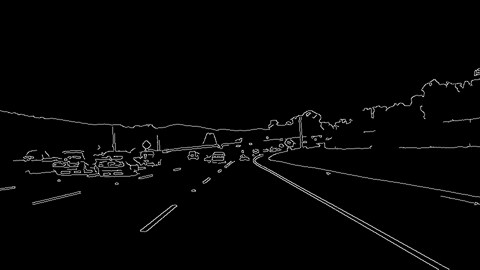
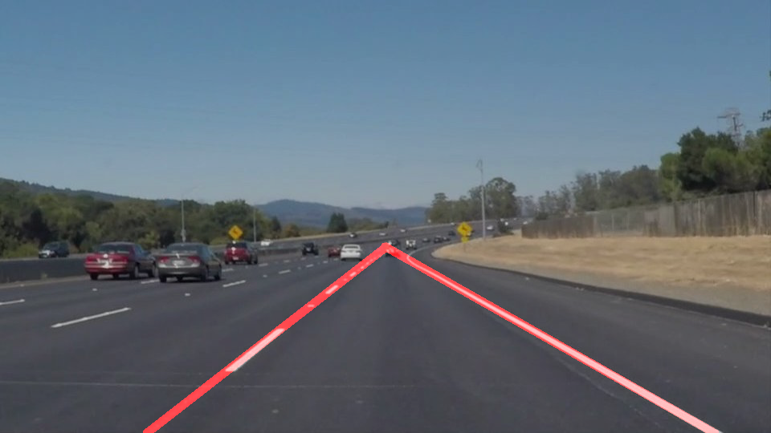

# Finding Lane Lines on the Road

The goals / steps of this project are the following:
* Make a pipeline that finds lane lines on the road
* Reflect on your work in a written report

### Pipeline

#### 1. read the image


#### 2. convert it to grayscale

```
cv2.cvtColor(img, cv2.COLOR_RGB2GRAY)
```


#### 3. blur it using a gaussian kernel

```
kernel_size = 5
cv2.GaussianBlur(img, (kernel_size, kernel_size), 0)
```


#### 4. detect the edges

```
cv2.Canny(img, low_threshold, high_threshold)
```



#### 5. narrow down the seach area to a region of inetest

```
cv2.fillPoly(mask, vertices, ignore_mask_color)
masked_image = cv2.bitwise_and(img, mask)
```


#### 6. find the lines using hough transform

```
cv2.HoughLinesP(img, rho, theta, threshold, np.array([]),
                minLineLength=min_line_len, maxLineGap=max_line_gap)
```


#### 7. draw the lines

update `draw_lines()` function:

1. The slopes were calculated for all the detected lines.
2. convert slope to theta
3. The lines were grouped into two gropus (rising, falling).
4. The lines with a theta below +/- 10° are ignored
5. average thetas and bias
6. draw lines

```
#cv2.line(img, (x1, y1), (x2, y2), color, thickness)
draw_lines(img)

cv2.addWeighted(initial_img, α, img, β, λ)
```



### Identify potential shortcomings with your current pipeline

* I do not know that it will work if it's night
* There are not necessarily lanes


### Suggest possible improvements to your pipeline

To make pipeline more robust ...

* search more robust parameter by trying other condition
* apply machine learning
